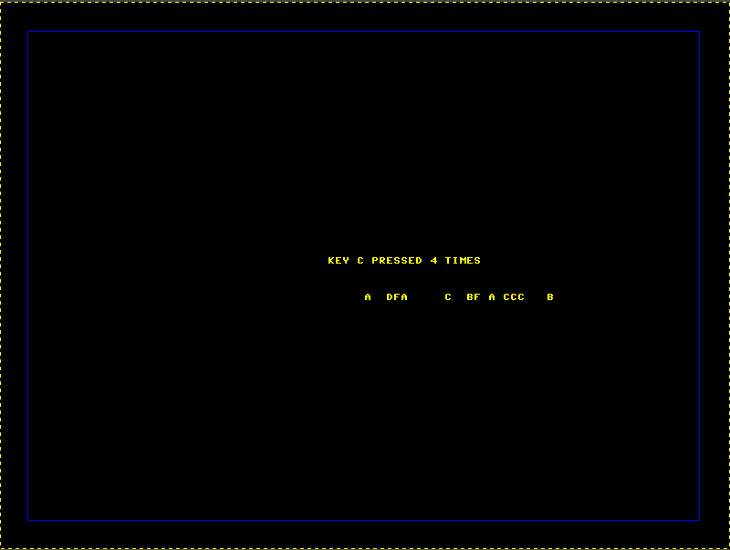

Laiy24 400268588
Pany57 400247013

## Assumption 
Since it is not mentioned in the requirement file, we will assume the VGA works only 31 keys are all pressed, so that the printed process will not miss any necessary information. To do this, `enable` will be 0 at reset state and be 1 again when 31 keys are all received. 

## Remove Artifact 
To remove the artifact effect on cha, we use `delay_X_pos[2:0]` which is the one-clock-delay of `pixel_X_pos[2:0]` to address the character in ROM.  We also set `PIPE_DELAY` be 2 to make sure the image starts at the correct col and row.

## Shift register for storing
Shift right for every input from the keyboard. Set 31 `PS2_reg` registers to store the inputs. Value stored in `PS2_reg` is already the ROM address for each character, and it requires no future conversion. In this stage, all non-monitored key will be stored in the address of a space `6'o40`.
Set a counter and `keypressed` variables to store the number of times every key is pressed. The value in `keypressed` will be compared. It finds the `maxpressed` value and stores the address of the key pressed the most often in the variable `maxpressed_address`.

## Print Info
After keys are received, the 31 keys will display starting at `KEYBOARD_MESSAGE_START_COL` and `KEYBOARD_MESSAGE_LINE`, which is 360 and 320 in our code. Since non-monitored keys are ready converted into space in the shift register, we only need to display all keys from the register at this stage.
To display the maximum number of times which key pressed the most often, we check `maxpressed`. If it is 0, it displays “NO MONITORED KEYS PRESSED”. It displays “KEYS x PRESSED n TIMES” for `maxpressed` less than 10, and “KEYS x PRESSED mn TIMES” for `maxpressed` have two digits.(x is the keys, and mn is the number of times it pressed) The printed line starts at `DEFAULT_MESSAGE_LIN` and `DEFAULT_MESSAGE_START_COL`, which is pixel 280 and 360 in our code.

 

