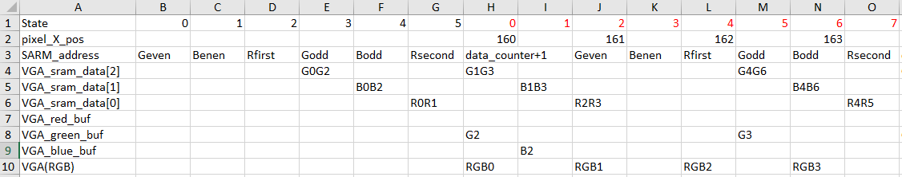

# Report
## State Machine
In every loop cycle, we will read data for four pixel, which is G0G2, B0B2, R0R1, G1G3, B1B3, R2R3. Since the VGA have half the clock frequency than that at top level, it required 8 clock cycle to transmit these 4 pixel data. Therefore, we name 8 state from `S_FETCH_PIXEL_DATA_0` to `S_FETCH_PIXEL_DATA_7`.

Each `VGA_sram_data` register will be written in new value twice in each loop cycle. Since green and blue info may be overwrited before it is transmitted to VGA, we use `VGA_blue_buf` and `VGA_green_buf` to buffer the value.

The first six clock cycle will be use to initialize the reading mode. Therefore, the read mode start when VGA reach 3 pixels before the experted printing x pixel position.

This pic shows value in each state. The state indicate in red will loop to the end of each row.
Note: VGA_red_buf is not necassary, so it is not decleared in verilog file.

In read mode, the total states used are:
(initialize clock cycle )
- S_WAIT_NEW_PIXEL_ROW,
- S_NEW_PIXEL_ROW_DELAY_1,
- S_NEW_PIXEL_ROW_DELAY_2,
- S_NEW_PIXEL_ROW_DELAY_3,
- S_NEW_PIXEL_ROW_DELAY_4,
- S_NEW_PIXEL_ROW_DELAY_5,
(loop read cycle)
- S_FETCH_PIXEL_DATA_0,
- S_FETCH_PIXEL_DATA_1,
- S_FETCH_PIXEL_DATA_2,
- S_FETCH_PIXEL_DATA_3,
- S_FETCH_PIXEL_DATA_4,
- S_FETCH_PIXEL_DATA_5,
- S_FETCH_PIXEL_DATA_6,
- S_FETCH_PIXEL_DATA_7,

## Resource Used
| Module (instance) |  LUT | Register |
| --- | --- |   ---   |
| experiment 1 | 341 | 261 |
| exercises 1(before edit) | 466 | 278 |
| exercises 1(finished) | 457 | 294 |

Exercises 1 (before edit) change its fill SRAM logic from experiment 1. The increase in used LUT is becuase the logic is more complecate. For exampel, the SRAM write address increase 1 in each clock cycle, while the address will jupm between differrent region like from 0 to 38400. The increase in Register is due to the increase in states and parameters like data\_counter[17:0] and GREEN_EVEN_BASE[17:0].

After edited the read mode in exercise 1, LUT costs less but register costs more. Register cost more because we add new parameter `VGA_blue_buf[7:0]` and `VGA_green_buf[7:0]`. Which cost 16 bits in total, and 278+16=294.

In terms of the LUT, the details are listed below:
| Module (instance) |  4 input LUT | 3 input LUT |  <= 2 input LUT |
| --- | --- |   ---   |   ---   |
| exercises 1(before edit) | 239 | 38 | 189 |
| exercises 1(finished) | 234 | 62 | 162 |

Some 2-input LUT have transfered into 3-input LUT due to more states and more complex logic. For example: 
In finished exercise:
- `S_FETCH_PIXEL_DATA_0` or `S_FETCH_PIXEL_DATA_2`: `VGA_blue <= VGA_sram_data[1][15:8]`;
- `S_FETCH_PIXEL_DATA_4`: `VGA_blue <= VGA_blue_buf`;
- `S_FETCH_PIXEL_DATA_6`: `VGA_blue <= VGA_sram_data[1][7:0]`;

In exercise before editted:
- `S_FETCH_PIXEL_DATA_0`: `VGA_blue <= VGA_sram_data[1][15:8]`
- `S_FETCH_PIXEL_DATA_2`: `VGA_blue <= VGA_sram_data[0][7:0]`

## Register Used in Read Mode

| Module (instance) |  Register name | Bits | Description |
| --- | --- |   ---   | --- |
| Top-level experiment 1 | SRAM\_address | 18 | Address register used for accessing the external memory (i.e., the external SRAM organized as 218 x 16) |
| Top-level experiment 1 | VGA\_sram\_data [2] | 16 | Buffer register - holds the Green data for the pixels before it is ready to be transferred to the VGA controller. It can hold even or odd pixel information depends on current value in `state` |
| Top-level experiment 1 | VGA\_sram\_data [1] | 16 | Buffer register - holds the Blue data for the pixels before it is ready to be transferred to the VGA controller. It can hold even or odd pixel information depends on current value in `state` |
| Top-level experiment 1 | VGA\_sram\_data [0] | 16 | Buffer register - holds the Red data for the pixels before it is ready to be transferred to the VGA controller. It can hold first or second pixel information depends on current value in `state` |
| Top-level experiment 1 | VGA\_blue\_buf | 8 | Buffer register - holds the blue data for one pixel before it is ready to be transferred to the VGA controller. It generally stores data from `VGA_sram_data [1][15:8]` depends on the current `state` |
| Top-level experiment 1 | VGA\_green\_buf | 8 | Buffer register - holds the green data for one pixel before it is ready to be transferred to the VGA controller. It generally stores data from `VGA_sram_data [2][15:8]` depends on the current `state` |
| Top-level experiment 1 | state | 5 | State register used by the FSM that coordinates the data transfers to/from the external SRAM and to the VGA controller |
| Top-level experiment 1 | data\_counter | 18 | It is the base address to determine the SARM read address. Example: R0R1 is at `data_counter<<1`, R2R3 is at `data_counter<<1+1`, G0G2 is at `data_counter + GREEN_EVEN_BASE`, G2G3 is at `data_counter + GREEN_ODD_BASE`, B0B2 is at `data_counter + BLUE_EVEN_BASE`, B1B3 is at `data_counter + BLUE_ODD_BASE`  |
| Top-level experiment 1 | VGA\_red   | 8 | Red data of pixel that is trasmitted to VGA and printed on the screen. Its value will be either from `VGA_sram_data [0][15:8]` or `VGA_sram_data [0][7:0]`  |
| Top-level experiment 1 | VGA\_green  | 8 | Green data of pixel that is trasmitted to VGA and printed on the screen. Its value will be either from `VGA_sram_data [2][15:8]`, `VGA_sram_data [2][7:0]`, or `VGA_green_buf`  |
| Top-level experiment 1 | VGA\_blue   | 8 | Blue data of pixel that is trasmitted to VGA and printed on the screen. Its value will be either from `VGA_sram_data [1][15:8]`, `VGA_sram_data [1][7:0]` or `VGA_blue_buf`  |

